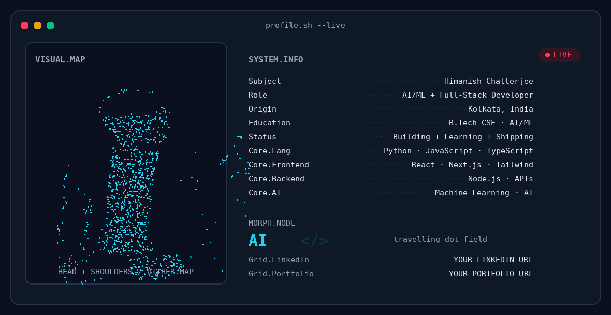

# 👋 Hi, I'm Himanish Chatterjee

  <picture>
    <source media="(prefers-color-scheme: dark)" srcset="./assets/banner-animated.gif">
    <source media="(prefers-color-scheme: light)" srcset="./assets/banner-light.png">
    
  </picture>

  <b>AI/ML • Full-Stack Development • Open Source • Building in Public</b>

---

## 📊 GitHub Activity

  
  

  

---

## 🐍 Contribution Activity

<picture>
  <source media="(prefers-color-scheme: dark)" srcset="https://raw.githubusercontent.com/MindfulTechie-06/MindfulTechie-06/output/github-contribution-grid-snake-dark.svg">
  <source media="(prefers-color-scheme: light)" srcset="https://raw.githubusercontent.com/MindfulTechie-06/MindfulTechie-06/output/github-contribution-grid-snake.svg">
  
</picture>

---

## 🛠️ Tech Stack

### 💻 Languages

  

### 🎨 Frontend

  

### ⚙️ Backend & APIs

  

### 🤖 AI / ML

  

### 🗄️ Databases & Cloud

  

### 🔧 Tools & Workflow

  

---

## ⭐ Featured Repositories

  
  

  
  

  
  

  

---

## 🌐 Connect With Me

  
  &nbsp;&nbsp;
  
  &nbsp;&nbsp;
  

---

  Building things • Learning continuously • Contributing to open source

