# 👋 Hi, I'm Himanish Chatterjee

  <picture>
    <source media="(prefers-color-scheme: dark)" srcset="./assets/banner-dark.svg">
    <source media="(prefers-color-scheme: light)" srcset="./assets/banner-light.svg">
    
  </picture>

## 📊 GitHub Activity

  
  

  

## 🐍 Contribution Activity

<picture>
  <source media="(prefers-color-scheme: dark)" srcset="https://raw.githubusercontent.com/MindfulTechie-06/MindfulTechie-06/output/github-contribution-grid-snake-dark.svg">
  <source media="(prefers-color-scheme: light)" srcset="https://raw.githubusercontent.com/MindfulTechie-06/MindfulTechie-06/output/github-contribution-grid-snake.svg">
  
</picture>

## 🛠️ Tech Stack

  
  &nbsp;&nbsp;
  
  &nbsp;&nbsp;
  
  &nbsp;&nbsp;
  
  &nbsp;&nbsp;
  
  &nbsp;&nbsp;
  
  &nbsp;&nbsp;
  

## 🌐 Connect

  
  &nbsp;&nbsp;
  
  &nbsp;&nbsp;
  

---

  Building things, learning in public, and contributing to open source.

