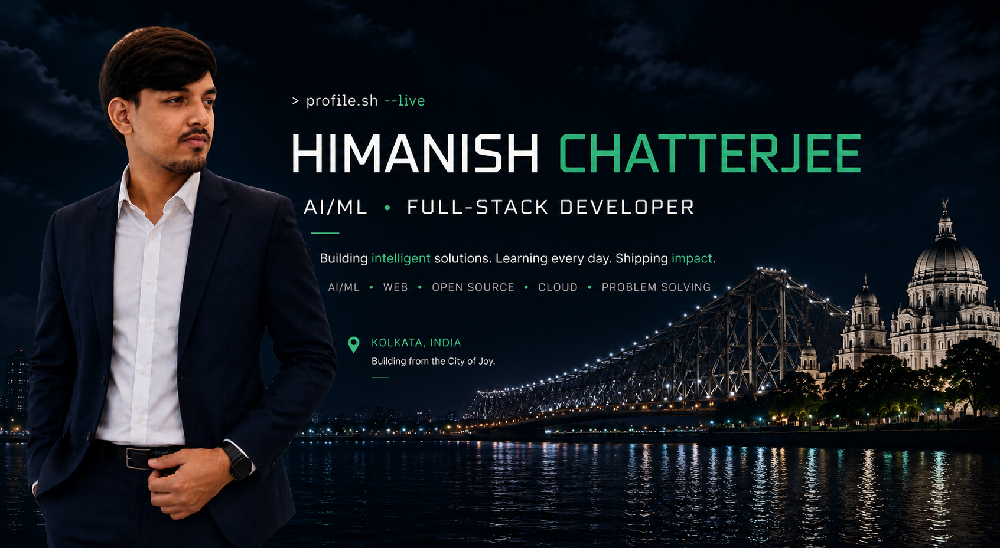

# 👋 Hi, I'm Himanish Chatterjee

 

 

 

 

 

 

# 📊 GitHub Stats

# 📊 GitHub Stats

  
  

  

## 🐍 Contribution Activity

  

---

## 🛠️ Tech Stack

### 💻 Languages

  

### 🎨 Frontend

  

### ⚙️ Backend & APIs

  

### 🤖 AI / ML

  

### 🗄️ Databases & Cloud

  

### 🔧 Tools & Workflow

  

---

## 🚀 Featured Repositories

<table>
<tr>

<td width="50%">

### 🌐 Portfolio

<a href="https://github.com/MindfulTechie-06/Portfolio_New">
<b>Portfolio_New</b>
</a>

My personal developer portfolio showcasing my projects, skills and experience.

</td>

<td width="50%">

### 🛡️ AuraShield

<a href="https://github.com/MindfulTechie-06/Aurashield">
<b>Aurashield</b>
</a>

An AI/security focused project built around intelligent protection and analysis.

</td>

</tr>

<tr>

<td width="50%">

### ⚡ Grid Sense AI

<a href="https://github.com/MindfulTechie-06/grid-sense-ai">
<b>grid-sense-ai</b>
</a>

AI-powered project focused on intelligent grid and sustainability solutions.

</td>

<td width="50%">

### 🧠 Architect AI

<a href="https://github.com/MindfulTechie-06/architect-ai">
<b>architect-ai</b>
</a>

An AI-focused project exploring intelligent development workflows.

</td>

</tr>
</table>

---

## 🌐 Connect With Me

  
  &nbsp;&nbsp;
  
  &nbsp;&nbsp;
  

---

  Building things • Learning continuously • Contributing to open source

